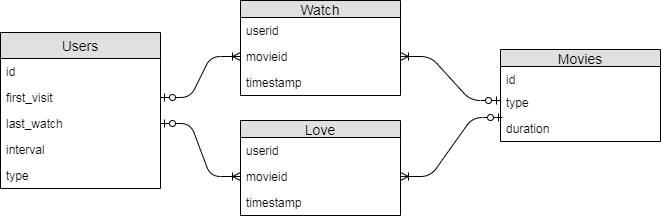
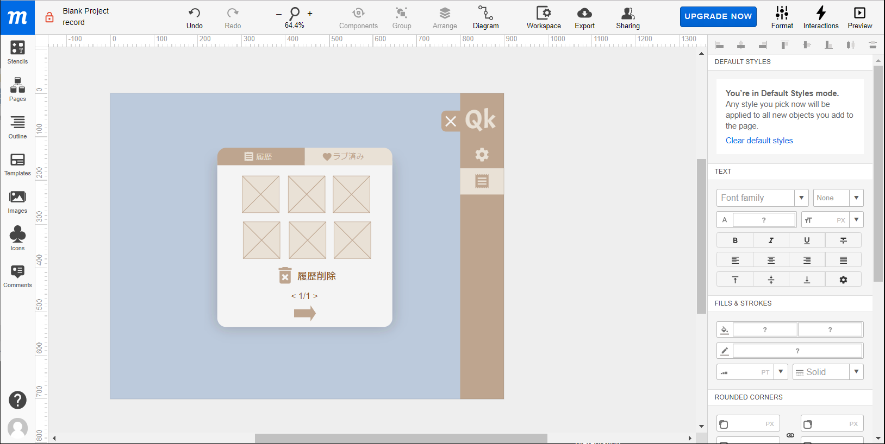
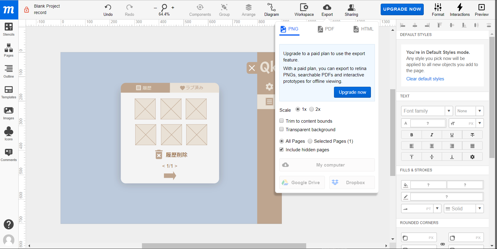

<h1 id="hongo">Webアプリケーション（Python）科 
最終課題</h1>

千田岳

---

## このプレゼンについて

reveal.jsを利用しています

https://senderga.github.io/20191030_presen/

---

## Webアプリ

QK
<!-- .element: class="fragment" -->

QuickKawaii
<!-- .element: class="fragment" -->

https://qk.send.gq/<!-- .element: class="fragment" -->

--

気分転換にかわいい動画を見るサイトです

--

ただし1分半（90秒）だけ

--

## パワーオブカワイイ

[The Power of Kawaii: Viewing Cute Images Promotes a Careful Behavior and Narrows Attentional Focus](https://journals.plos.org/plosone/article?id=10.1371/journal.pone.0046362)

--

### 入戸野宏 大阪大教授

（にっとの・ひろし）

--

[眺めていいのは1分半まで。「かわいいもの」を見て集中力をアップさせる方法があった](https://r25.jp/article/568605284530419503)

>かわいいものや人を見ると脳の中には「もっと見たい、ずっと見ていたい」という、細かい部分に集中する心理状態が生まれます。

>それはしばらく続き、別の課題や作業をするときにも持ち越されます。

--

[眺めていいのは1分半まで。「かわいいもの」を見て集中力をアップさせる方法があった](https://r25.jp/article/568605284530419503)

>だから、「かわいい」と感じることは細部に注目する状態をつくり出す、つまり「集中力を高める要因になっている」と言えるのです。

--

>大事なのは接触時間です。（中略）

>（略）「見ることで気分はよくなるが、ハマりすぎると仕事モードに戻れない弊害もある」という海外の研究があります。

>私たちの研究では、かわいいものを見せる時間は1分～1分半という長さでした。

--

## [「かわいい」のちから 実験で探るその心理](https://www.amazon.co.jp/dp/475981681X/)

--

## リファレンス

[Street View Random Walker さまよえる私](https://samayoeru.me/)

[Mubert](https://mubert.com/)

---

## バックエンド

Google Compute Engine（GCE)

---

## Google Compute Engine

Google Cloud Platform（GCP）の一部。

いわゆる **Iaas**

インターネット上に仮想マシン（インスタンス）

最小限の構成であれば無料で使える

訓練中にやってきたことが活かせる

--

実践してみる

https://console.cloud.google.com/compute/instances

---

## GCP のインスタンスを
## イメージから作る

VirtualBoxの仮想ディスクの標準はVDI

virtualboxManageという付属ツールでVHDに変換

Google Cloud Platform のストレージに上げて、

イメージに変換（これにもお金はかかる）

---

## フレームワーク

bottle

他はノーフレームワーク・ノーライブラリ

で、PJAX(pushstate + AJAX)まで行きたかったなあ…

---

## WSGI

--

## Apache + mod_wsgi

+ python3とpython3-develをyumでインストール
  + ↑特に指定なしでも組み込みのpythonと競合しません
  + Python3で実行
  + むしろなにかやろうとする(SymLink書き換えるとか)と大変なことに
+ yum groupinstall "development tools"</code>(gccが必要)
+ httpdとhttpd-develをインストール
+ mod_wsgiをpip(pip3)でインストール

--

## Apache + mod_wsgi

+ mod_wsgi-expressでmodule-configでwsgi_moduleのパスと、WSGIPythonHomeを確認
+ /etc/httpd/conf/httpd.confを編集
  + 上記のmod_wsgiとWSGIPythonHomeのパス、そしてWSGIScriptAliasを指定する
+ WSGIScriptAliasとしてアプリケーション本体を指定
  + bottleの場合、bottle.default_app()をapplicationとして渡す

--

## nginx + uWsgi
+ python3 python3-devel gcc などインストール
+ uwsgiをpip(pip3)でインストール
+ /etc/nginx/nginx.confを編集
  + location / がuwsgiにバイパスするように設定
  + <pre><code data-trim data-noescape>
location / {
    proxy_pass http://127.0.0.1:8000;
}
</pre>
+ uwsgiのiniファイルを作成

--

## nginx + gunicorn

手順的にはuwsgiと一緒

デーモン化にはsupervisor使用

--

## gunicornの設定ファイル

<pre><code data-trim data-noescape>
import multiprocessing
# socket
pid = "/run/gunicorn/pid"
bind = "127.0.0.1:8000"
# Logging
access-logfile = "/var/log/gunicorn/access"
error-logfile = "/var/log/gunicorn/error"
capture-output = True
log-level = 'debug'
# worker processes
workers = multiprocessing.cpu_count() * 2 + 1
worker_class = 'sync'
worker_connections = 100
timeout = 30
keepalive = 1
# process name
proc_name = 'gunicorn_bottle'
</code></pre>

--

## supervisorの設定ファイル

<pre><code data-trim data-noescape>
[program:gunicorn_app]
command=/opt/dev/bin/gunicorn app:application --config
directory=/opt/app
process_name=%(program_name)s
user=nginx
autorestart=true
stdout_logfile=/var/log/supervisor/jobs/guni_app_supervisord.log
stdout_logfile_maxbytes=1MB
stdout_logfile_backups=5
stdout_capture_maxbytes=1MB
redirect_stderr=true
startsecs=5
</code></pre>

---

## Qkのデータベース

---

## Qkのデータベース

https://qk.send.gq/tables

---

## 動画登録・削除

https://qk.send.gq/movie_register

+ /movie/post/&lt;id&gt;にPOSTで登録
+ /movie/delete/&lt;id&gt;でDELETEで削除

---

## やりたかったこと:PJAX

Pushstate + AJAX

SPA(Single Page Application)

PWA(Progressive Web Application)

---

## やりたかったこと: SVGアニメーション

---

## Webアプリの作り方
[作りたいWebアプリのアイディアを迷走せずに作る方法。まず、エディターを閉じることから始めよう](https://blog.hirokiky.org/entry/2018/11/02/222005)

WSGIについて調べている途中で発見

- アプリでどんな問題を解決するのか→価値問診票
- どうやって解決するのか→画面モックアップ

---

---

---

## 今後興味があること

データビジュアライゼーション

ビジュアルコーディング

---

## データビジュアライゼーション

## [Pythonで学び直す高校数学](https://www.amazon.co.jp/dp/B07PTZF8K2)

途中までしか読んでないけどいい本

---

## ビジュアルコーディング

Processing

https://processing.org/

---

# THANK YOU
